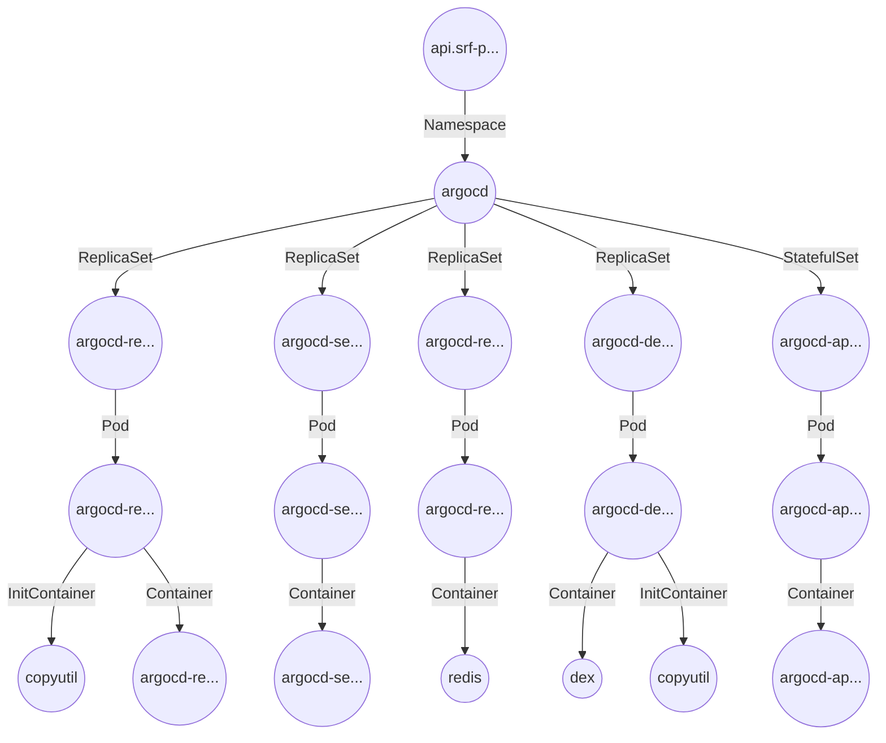

```mermaid
graph
  d5a5c46d-2ef6-438f-bdc9-37359da20d6b((argocd-de...)):::ReplicaSet
  e3ee86e5-a1d5-4528-8e0c-5b526f7ba97a((argocd-re...)):::ReplicaSet
  c5f9bbd9-121f-4c57-cfcc-01346830b577((redis)):::Container
  17f17d76-c4f1-c409-5cab-f9746ec8b1dd((api.srf-p...)):::Cluster
  5a2ff591-752e-47e3-a959-8b6d23fd0a76((argocd-ap...)):::StatefulSet
  9e616de4-14ae-bea1-aad3-407de44c8d01((argocd-ap...)):::Container
  ab1324ff-472c-4f04-bfcc-8e98a4f5b617((argocd-de...)):::Pod
  614f4ca4-0c69-4947-b79e-dcbf5df5044c((argocd-re...)):::Pod
  6b07a192-1b9b-e0ef-a7c2-011c111e2c2c((argocd-re...)):::Container
  09b910a7-5072-e8b4-f364-b8495d6d0d58((argocd)):::Namespace
  86ee4a5e-baa3-7a43-b63a-f87f69c03ef8((argocd-se...)):::Container
  448e1b8b-f7ea-b441-3df9-9fb71f7e60bd((copyutil)):::Container
  75f44683-7ef0-cdfb-dd1c-d72a1d6bb7e5((dex)):::Container
  ebedf49a-e0f6-456f-9f02-81794bf118f5((argocd-se...)):::Pod
  f663d2d7-e91b-b0b5-fae0-e5e3ae7e5dbb((copyutil)):::Container
  461db00e-443f-4ff8-a634-f7a5570d6fe7((argocd-se...)):::ReplicaSet
  d0d8c3c0-8970-469b-8024-568098eb08aa((argocd-ap...)):::Pod
  05ddda91-d774-4e83-b472-e77887cae7e1((argocd-re...)):::Pod
  441b0c5d-7447-4a24-be28-4af8282321f8((argocd-re...)):::ReplicaSet
  09b910a7-5072-e8b4-f364-b8495d6d0d58 -- ReplicaSet --> 441b0c5d-7447-4a24-be28-4af8282321f8
  09b910a7-5072-e8b4-f364-b8495d6d0d58 -- ReplicaSet --> 461db00e-443f-4ff8-a634-f7a5570d6fe7
  09b910a7-5072-e8b4-f364-b8495d6d0d58 -- ReplicaSet --> e3ee86e5-a1d5-4528-8e0c-5b526f7ba97a
  441b0c5d-7447-4a24-be28-4af8282321f8 -- Pod --> 05ddda91-d774-4e83-b472-e77887cae7e1
  17f17d76-c4f1-c409-5cab-f9746ec8b1dd -- Namespace --> 09b910a7-5072-e8b4-f364-b8495d6d0d58
  e3ee86e5-a1d5-4528-8e0c-5b526f7ba97a -- Pod --> 614f4ca4-0c69-4947-b79e-dcbf5df5044c
  614f4ca4-0c69-4947-b79e-dcbf5df5044c -- Container --> c5f9bbd9-121f-4c57-cfcc-01346830b577
  05ddda91-d774-4e83-b472-e77887cae7e1 -- InitContainer --> f663d2d7-e91b-b0b5-fae0-e5e3ae7e5dbb
  05ddda91-d774-4e83-b472-e77887cae7e1 -- Container --> 6b07a192-1b9b-e0ef-a7c2-011c111e2c2c
  5a2ff591-752e-47e3-a959-8b6d23fd0a76 -- Pod --> d0d8c3c0-8970-469b-8024-568098eb08aa
  d0d8c3c0-8970-469b-8024-568098eb08aa -- Container --> 9e616de4-14ae-bea1-aad3-407de44c8d01
  461db00e-443f-4ff8-a634-f7a5570d6fe7 -- Pod --> ebedf49a-e0f6-456f-9f02-81794bf118f5
  09b910a7-5072-e8b4-f364-b8495d6d0d58 -- ReplicaSet --> d5a5c46d-2ef6-438f-bdc9-37359da20d6b
  d5a5c46d-2ef6-438f-bdc9-37359da20d6b -- Pod --> ab1324ff-472c-4f04-bfcc-8e98a4f5b617
  ab1324ff-472c-4f04-bfcc-8e98a4f5b617 -- Container --> 75f44683-7ef0-cdfb-dd1c-d72a1d6bb7e5
  09b910a7-5072-e8b4-f364-b8495d6d0d58 -- StatefulSet --> 5a2ff591-752e-47e3-a959-8b6d23fd0a76
  ab1324ff-472c-4f04-bfcc-8e98a4f5b617 -- InitContainer --> 448e1b8b-f7ea-b441-3df9-9fb71f7e60bd
  ebedf49a-e0f6-456f-9f02-81794bf118f5 -- Container --> 86ee4a5e-baa3-7a43-b63a-f87f69c03ef8
```
